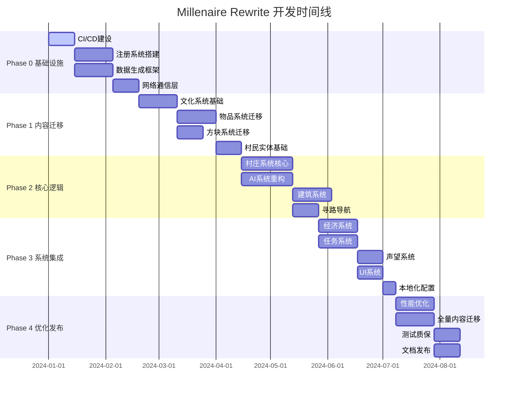

# Millenaire Rewrite 开发计划与路线图

## 项目概述

**项目名称**: Millenaire Rewrite
**当前状态**: 已搭建 1.20.1 Forge 基础项目结构，制定代码规范
**最终目标**: 将 1.12.2 的千年村庄 Mod 核心功能完整迁移至 1.20.1，并优化改进
**项目规模**: ~50,000+行代码，200+核心类，7 种文化体系

---

## 1. 总体策略与原则

### 1.1 开发策略

- **迭代开发**: 采用分阶段、可验证的迭代方式，每个阶段产生可编译、可测试的版本
- **优先级导向**: 遵循"基础框架 → 核心内容 → 核心逻辑 → 高级功能"的依赖顺序
- **风险优先**: 将技术不确定性高、工作量大的任务前置，尽早暴露和解决问题
- **快乐路径**: 优先实现主要功能流程，再处理边缘情况和异常处理

### 1.2 技术原则

- **现代化重写**: 充分利用 1.20.1 Forge 的新特性和 API
- **可维护性**: 遵循 SOLID 原则，保持代码简洁和模块化
- **性能优先**: 考虑村庄模拟的性能影响，优化数据结构和算法
- **向后兼容**: 在可能的情况下保持数据格式的兼容性

### 1.3 质量保证

- **持续集成**: 建立自动化构建和测试流水线
- **代码审查**: 遵循既定的编码规范和最佳实践
- **单元测试**: 为核心业务逻辑编写单元测试
- **集成测试**: 定期进行完整功能测试

---

## 2. 阶段划分（Phases/Milestones）

### Phase 0: 项目基础设施与现代化框架 (预计 4-6 周)

#### 目标

建立健壮的开发基础，告别 1.12.2 的陈旧模式，为后续开发奠定坚实基础。

#### 预期成果

一个空 Mod，但拥有完整、现代的 Forge 项目基础设施，包含 CI/CD、数据生成、注册系统等核心框架。

#### 主要任务清单

**🔧 基础设施建设 (1-2 周)**

- [x] 配置 GitHub Actions CI/CD 流水线
  - 自动构建验证
  - 代码质量检查（SpotBugs、Checkstyle）
  - 自动化测试运行
- [x] 建立版本管理策略
  - 语义化版本控制
  - 自动版本号生成
  - 发布流程自动化
- [x] 配置开发环境模板
  - IntelliJ IDEA 运行配置
  - 调试配置优化
  - 代码格式化规则

**🏗️ 核心框架搭建 (2-3 周)**

- [x] 实现统一注册系统
  - 基于 DeferredRegister 的现代注册方式
  - 创建 RegistryHelper 工具类
  - 建立注册事件处理机制
- [x] 搭建数据生成（DataGen）框架
  - 物品模型生成器
  - 方块状态生成器
  - 配方生成器
  - 标签生成器
  - 语言文件生成器
- [x] 建立网络通信层基础
  - PacketHandler 基类设计
  - 客户端-服务端通信协议
  - 数据序列化/反序列化工具
- [x] 配置系统现代化
  - 基于 Forge Config API
  - 客户端/服务端配置分离
  - 配置热重载支持

**📁 项目结构优化 (1 周)**

- [x] 完善包结构组织
- [x] 建立 API 接口层
- [x] 创建核心常量和枚举定义
- [x] 设计日志记录系统

#### 依赖关系

- **前置要求**: 已完成的基础项目结构和代码规范
- **为后续奠定**: 所有功能开发的基础框架和工具链

#### 风险点

- GitHub Actions 配置复杂性
- DataGen 系统学习曲线
- 网络协议设计的前瞻性

---

### Phase 1: 核心内容迁移 - 文化、物品、方块、实体 (预计 6-8 周)

#### 目标

将核心内容资产迁移到 1.20.1，建立文化系统基础，让基础内容在游戏中可见可用。

#### 预期成果

可以在创造模式中看到并使用千年村庄的物品和方块，世界中可以生成会移动但功能简化的村民实体。

#### 主要任务清单

**🏛️ 文化系统基础 (2-3 周)**

- [x] 设计 Culture 基类和数据结构
  - 文化标识符系统（CultureType 枚举）【要求：枚举设计必须支持原版文化和新增华夏文化的扩展】
  - 文化配置文件格式（JSON）【要求：配置格式应具备高度灵活性，支持不同文化体系的差异化配置】
  - 文化资源加载器（CultureLoader）
- [x] 实现文化注册和管理系统
  - CultureRegistry 单例管理器【要求：注册系统应设计为可插拔架构，便于后续添加华夏等新文化】
  - 文化数据验证机制
  - 客户端-服务端数据同步
- [x] 迁移核心文化数据
  - Norman（诺曼）文化基础数据
  - Japanese（日本）文化基础数据
  - Byzantine（拜占庭）文化基础数据
  - 建立文化间差异化配置
- [x] **(新增)** 创建华夏文化基础数据
  - 华夏文化标识符和基础配置
  - 华夏文化特色建筑风格定义
  - 华夏文化社会结构和职业体系设计

**🗡️ 物品系统迁移 (2-3 周)**

- [x] 建立物品分类体系
  - 货币系统（Denier、DenierOr、DenierArgent）
  - 文化工具（各文化特色工具）
  - 文化武器（剑、弓、盔甲）
  - 贸易商品（食物、原材料、奢侈品）
  - 特殊物品（召唤法杖、护身符）
- [x] **(新增)** 创建华夏文化物品分类体系
  - 华夏货币系统（铜钱、银两、金锭等）
  - 华夏特色工具（农具、手工业工具等）
  - 华夏武器装备（环首刀、弩、盔甲等）
  - 华夏贸易商品（茶叶、瓷器、丝绸、香料等）
  - 华夏特殊物品（卷轴、印章、风水罗盘等）
- [x] 实现物品注册和数据生成
  - 使用 DeferredRegister 注册所有物品【要求：注册系统必须支持动态文化物品扩展】
  - 自动生成物品模型 JSON
  - 配置物品属性和行为
- [x] 迁移物品交互逻辑
  - 货币价值计算系统【要求：系统应支持多种货币体系并存和汇率转换】
  - 物品堆叠规则
  - 特殊物品使用效果

**🧱 方块系统迁移 (2 周)**

- [x] 文化建筑方块迁移
  - 各文化特色建筑材料
  - 装饰性方块（旗帜、雕像）
  - 功能性方块（工作台、火炉）
- [x] **(新增)** 华夏文化建筑方块创建
  - 华夏特色建筑材料（青砖、红墙、琉璃瓦等）
  - 华夏装饰方块（灯笼、屏风、石狮、牌坊等）
  - 华夏功能方块（茶桌、药鼎、织机、印刷台等）
- [x] 方块实体（BlockEntity）系统
  - 现代化 TileEntity → BlockEntity 迁移【要求：BlockEntity 系统应设计为模块化，支持文化特定的数据和行为扩展】
  - 数据存储和同步机制
  - 方块交互逻辑
- [ ] **(延后)** 建筑组件系统
  - 墙壁、屋顶、地板组件
  - 门窗系统
  - 楼梯和台阶变体
- [ ] **(延后)** 华夏建筑组件系统
  - 华夏建筑构件（斗拱、飞檐、回廊等）
  - 华夏门窗样式（月门、花窗、雕花门等）
  - 华夏庭院元素（假山、池塘、亭台等）

**👤 村民实体基础 (1-2 周)**

- [ ] MillVillager 实体类迁移
  - 基于新的 Entity API 重写
  - 基础移动和物理属性
  - 渲染和动画系统【要求：渲染系统应支持文化差异化的外观和动画变体】
- [ ] 村民外观系统
  - 文化相关的纹理和模型
  - 职业装扮系统
  - 性别和年龄变化
- [ ] **(新增)** 华夏村民外观设计
  - 华夏服饰纹理（汉服、官服、工匠服等）
  - 华夏职业特色装扮（学者、商贾、工匠、农夫等）
  - 华夏文化特色外观元素（发髻、饰品、面部特征等）
- [ ] 基础 AI 框架
  - 简化的移动 Goal
  - 基础的交互 Goal
  - 生存需求（暂时简化）

#### 依赖关系

- **前置要求**: Phase 0 的注册系统和数据生成框架
- **为后续奠定**: 村庄系统和 AI 系统的内容基础

#### 风险点

- 1.20.1 实体系统 API 变化较大
- 文化数据格式设计的扩展性
- 大量纹理和模型资源的处理

---

### Phase 2: 核心逻辑迁移 - 村庄模拟与 AI 系统 (预计 8-10 周)

#### 目标

实现村庄的核心运行逻辑和村民的智能行为系统，使村庄能够自主运行和发展。

#### 预期成果

村庄可以生成并独立运行，村民能够根据职业进行工作、建造、贸易等基本活动，具备完整的生存和发展循环。

#### 主要任务清单

**🏘️ 村庄系统核心 (3-4 周)**

- [ ] 村庄数据结构设计
  - Village 类重构（基于现代数据管理）【要求：Village 类必须设计为抽象化基类，能够支持多种文化类型的村庄，而不仅仅是原版文化】
  - 村庄状态持久化（使用 Attachment API）
  - 村庄边界和区域管理系统
- [ ] 村庄生命周期管理
  - 村庄创建和初始化流程【要求：初始化系统应支持基于文化类型的差异化村庄生成】
  - 村庄升级和发展机制
  - 村庄衰落和消失条件
- [ ] 村庄模拟系统
  - 每日 Tick 和时间管理
  - 资源生产和消耗模拟【要求：资源系统应设计为可配置，支持不同文化的独特资源类型】
  - 人口增长和管理
  - 建筑规划和建设队列

**🧠 AI 系统重构 (3-4 周)**

- [ ] Goal 系统现代化
  - 基于 1.20.1 的 Goal API 重写
  - 优先级和中断机制
  - Goal 状态持久化
- [ ] 核心 AI Goal 实现
  - GoalWork（工作行为）【要求：AI 系统应设计为可配置和可扩展，以便后续为不同文化（如华夏）注入独特行为】
  - GoalMoveToBlock（移动到方块）
  - GoalBuild（建造行为）
  - GoalGather（收集资源）
  - GoalTrade（贸易行为）
  - GoalSocialize（社交行为）
- [ ] 村民职业系统
  - 职业分配和变更机制【要求：职业系统应支持文化特定的职业类型和行为模式】
  - 技能等级和经验系统
  - 职业特定的工作流程

**🏗️ 建筑系统 (2-3 周)**

- [ ] 建筑规划系统（BuildingPlan）
  - 建筑蓝图数据结构【要求：蓝图系统必须支持多种建筑风格和文化特色，具备高度的可扩展性】
  - 建筑分解为建造步骤
  - 材料需求计算和管理
- [ ] 建筑生成算法
  - 地形适应性建造
  - 多层建筑支持
  - 建筑风格文化差异化【要求：算法应预留华夏等新文化建筑风格的接口和参数】
- [ ] 建筑进度管理
  - 建造队列和优先级
  - 材料供应链管理
  - 建造进度可视化

**🗺️ 寻路和导航 (1-2 周)**

- [ ] 现代化寻路系统
  - 基于 Minecraft 原生寻路优化
  - 村庄内部路径缓存
  - 多层建筑寻路支持
- [ ] 区域和 POI（兴趣点）系统
  - 工作区域定义和管理
  - 住宅区域分配
  - 公共设施访问管理

#### 依赖关系

- **前置要求**: Phase 1 的文化系统、物品方块、村民实体基础
- **为后续奠定**: 经济系统、任务系统、玩家交互的核心基础

#### 风险点

- AI 系统性能优化挑战（大量村民同时运行）
- 建筑生成算法的复杂性和性能
- 村庄数据持久化的数据量和同步问题
- 1.20.1 Goal API 与 1.12.2 差异巨大

---

### Phase 3: 系统集成与玩法完善 (预计 6-8 周)

#### 目标

实现玩家与村庄的交互系统，完善经济和任务系统，使 Mod 具备完整可玩的游戏循环。

#### 预期成果

一个功能基本完整的千年村庄 Mod，玩家可以与村民交易、接受任务、建立声望，体验完整的村庄发展和文化交融。

#### 主要任务清单

**💰 经济系统 (2-3 周)**

- [ ] 村庄经济模型
  - 资源供需平衡算法
  - 价格动态调整机制【要求：价格系统应支持多货币体系和跨文化贸易汇率】
  - 贸易路线和商队系统
- [ ] **(新增)** 华夏文化经济特色
  - 华夏特有的贸易商品和定价体系
  - 华夏货币系统与其他文化的汇率机制
  - 华夏特色的商业模式（如茶马古道、丝绸之路贸易等）
- [ ] 玩家交易界面
  - 现代化交易 GUI 设计
  - 货币兑换系统
  - 批量交易支持
  - 交易历史记录
- [ ] 市场和商店系统
  - 村庄商店生成和管理
  - 特殊商品和稀有物品
  - 文化特色商品体系

**📋 任务系统 (2-3 周)**

- [ ] 任务框架设计
  - Quest 基类和任务类型系统【要求：任务系统应支持文化特定的任务类型和奖励机制】
  - 任务生成和分配机制
  - 任务进度跟踪和验证
- [ ] 核心任务类型实现
  - 收集任务（采集资源）
  - 建造任务（协助建设）
  - 护送任务（保护村民或商队）
  - 探索任务（发现新区域）
  - 文化交流任务
- [ ] **(新增)** 华夏文化独特任务链
  - 科举考试相关任务（收集古籍、寻找名师等）
  - 节庆活动任务（春节、中秋等传统节日）
  - 文化传承任务（学习书法、诗词、茶艺等）
  - 朝贡贸易任务（护送贡品、建立外交关系等）
- [ ] 任务奖励系统
  - 经济奖励（货币、物品）
  - 声望奖励
  - 特殊权限解锁

**⭐ 声望系统 (1-2 周)**

- [ ] 声望计算模型
  - 多维度声望评价（经济、军事、文化）
  - 文化间声望传播机制
  - 声望衰减和维持
- [ ] **(新增)** 华夏文化声望体系
  - 华夏特有的声望维度（学识、德行、功名等）
  - 与华夏村庄的特殊声望事件和奖励
  - 华夏文化的声望等级称号系统
- [ ] 声望效果系统
  - 交易价格优惠
  - 特殊任务和商品解锁
  - 村民态度和交互变化
  - 村庄发展加成效果

**🎮 用户界面系统 (1-2 周)**

- [ ] 核心 GUI 现代化
  - 村民信息界面
  - 村庄状态概览界面
  - 任务追踪界面
  - 声望和关系界面
- [ ] 交互体验优化
  - 右键交互菜单
  - 快捷操作支持
  - 视觉反馈和动画效果

**🌐 本地化和配置 (1 周)**

- [ ] 多语言支持完善
  - 英语、中文、法语、德语等主要语言
  - 动态文本生成支持
  - 文化相关文本本地化
- [ ] 配置系统完善
  - 游戏平衡性配置
  - 性能优化选项
  - 功能开关配置

#### 依赖关系

- **前置要求**: Phase 2 的村庄系统和 AI 系统
- **为后续奠定**: 优化和扩展的基础，Beta 测试准备

#### 风险点

- 经济平衡性调试的复杂性
- 任务系统的趣味性和重复性平衡
- GUI 系统的用户体验设计
- 多语言本地化的工作量

---

### Phase 4: 优化、测试与发布准备 (预计 6-8 周)

#### 目标

打磨 Mod 至发布质量，完成性能优化、全量内容迁移、文档编写和测试验证。

#### 预期成果

一个稳定、高性能、内容丰富的千年村庄 Mod，准备进行 Alpha/Beta 公开测试。

#### 主要任务清单

**⚡ 性能优化 (2-3 周)**

- [ ] 村庄系统性能分析
  - 村庄 Tick 性能剖析
  - 内存使用优化
  - 数据结构优化
- [ ] AI 系统性能优化
  - Goal 执行频率优化
  - 寻路算法性能调优
  - 村民数量限制和管理
- [ ] 渲染性能优化
  - 实体渲染批处理
  - LOD（细节层次）系统
  - 客户端数据缓存

**📦 全量内容迁移 (2-3 周)**

- [ ] 剩余文化迁移
  - Indian（印度）文化完整迁移
  - Mayan（玛雅）文化完整迁移
  - Inuit（因纽特）文化完整迁移
  - Seljuk（塞尔柱）文化完整迁移
- [ ] **(新增)** 华夏文化内容完善
  - 华夏文化完整建筑库实现
  - 华夏文化高级功能和特色系统
  - 华夏文化本地化文本和资源完善
- [ ] 完整建筑库迁移
  - 各文化完整建筑套件
  - 建筑装饰和变体
  - 特殊建筑和地标
- [ ] 高级功能迁移
  - 进阶任务类型
  - 特殊事件系统
  - 成就和进度系统

**🧪 测试与质量保证 (1-2 周)**

- [ ] 自动化测试套件
  - 单元测试（核心逻辑）
  - 集成测试（系统交互）
  - 性能基准测试
- [ ] 兼容性测试
  - 多版本 Minecraft 兼容性
  - 主流 Mod 兼容性测试
  - 服务器环境测试
- [ ] 用户体验测试
  - 新手引导流程
  - 游戏平衡性验证
  - 错误处理和恢复

**📚 文档和发布准备 (1-2 周)**

- [ ] 开发文档编写
  - API 文档生成
  - 架构设计文档
  - 贡献者指南
- [ ] 用户文档编写
  - 游戏内指南系统
  - Wiki 文档初版
  - 安装和配置指南
- [ ] 发布流程准备
  - 版本发布流水线
  - 更新日志生成
  - 社区反馈收集机制

#### 依赖关系

- **前置要求**: Phase 3 的完整功能实现
- **为后续奠定**: 公开测试和社区反馈收集基础

#### 风险点

- 性能优化可能需要重构部分核心代码
- 全量内容迁移的工作量可能超出预期
- 测试覆盖度和质量保证的时间成本
- 社区期待与实际产品的差距

---

## 3. 风险评估与缓解策略

### 3.1 技术风险

**🔥 高风险项目**

| 风险项目         | 风险描述                                                | 影响程度   | 缓解策略                                                                                              |
| ---------------- | ------------------------------------------------------- | ---------- | ----------------------------------------------------------------------------------------------------- |
| AI 系统 API 巨变 | 1.20.1 的 Goal API 与 1.12.2 差异巨大，可能导致大量重写 | ⭐⭐⭐⭐⭐ | 1. 早期进行 API 调研和原型验证 ` `2. 建立抽象层隔离 API 变化 ` `3. 准备降级方案（简化 AI 行为） |
| 性能瓶颈         | 大量村民和村庄可能导致严重性能问题                      | ⭐⭐⭐⭐   | 1. 建立性能基准测试 ` `2. 实现动态加载/卸载机制 ` `3. 引入分层优化策略                          |
| 数据迁移复杂性   | 1.12.2 数据格式与 1.20.1 不兼容                         | ⭐⭐⭐⭐   | 1. 开发数据转换工具 ` `2. 建立渐进式迁移流程 ` `3. 保留原始数据备份                             |

**⚠️ 中等风险项目**

| 风险项目          | 风险描述                             | 影响程度 | 缓解策略                                                                              |
| ----------------- | ------------------------------------ | -------- | ------------------------------------------------------------------------------------- |
| 第三方 Mod 兼容性 | 与 JEI、Curios 等流行 Mod 的兼容问题 | ⭐⭐⭐   | 1. 优先支持最流行的 Mod ` `2. 建立兼容性测试流程 ` `3. 提供配置选项禁用冲突功能 |
| 网络同步复杂性    | 客户端-服务端数据同步的稳定性        | ⭐⭐⭐   | 1. 使用 Forge 网络 API 最佳实践 ` `2. 实现数据校验和修复机制 ` `3. 提供调试工具 |

### 3.2 项目管理风险

**📅 进度风险**

| 风险项目   | 风险描述                     | 影响程度 | 缓解策略                                                                      |
| ---------- | ---------------------------- | -------- | ----------------------------------------------------------------------------- |
| 工作量低估 | 某些系统迁移复杂度超出预期   | ⭐⭐⭐⭐ | 1. 预留 20%缓冲时间 ` `2. 建立关键路径监控 ` `3. 准备功能降级预案       |
| 依赖阻塞   | 关键依赖项的延期影响整体进度 | ⭐⭐⭐   | 1. 识别并优先处理关键依赖 ` `2. 建立并行开发策略 ` `3. 准备临时解决方案 |

### 3.3 质量风险

**🐛 质量风险**

| 风险项目   | 风险描述                     | 影响程度 | 缓解策略                                                                      |
| ---------- | ---------------------------- | -------- | ----------------------------------------------------------------------------- |
| 游戏平衡性 | 经济和任务系统平衡性难以调试 | ⭐⭐⭐   | 1. 建立数据收集和分析工具 ` `2. 进行小规模内测 ` `3. 提供丰富的配置选项 |
| 用户体验   | GUI 和交互体验不如预期       | ⭐⭐⭐   | 1. 早期用户体验测试 ` `2. 收集社区反馈 ` `3. 迭代改进设计               |

---

## 4. 后续规划（Post-Launch）

### 4.1 短期计划（1.0.0 发布后 3-6 个月）

**🐛 稳定性改进**

- 收集和修复社区反馈的 Bug
- 性能优化和稳定性提升
- 兼容性问题解决

**🔧 功能完善**

- 补充缺失的高级功能
- 增强用户界面和交互体验
- 扩展配置和自定义选项

### 4.2 中期计划（6-12 个月）

**🌍 内容扩展**

- 添加新的文化体系（如 Celtic、Viking）
- 扩展建筑类型和装饰物品
- 增加特殊事件和节日系统

**🔗 生态集成**

- 与更多流行 Mod 的深度集成
- 开发第三方 API 支持
- 建立 Mod 包和整合包支持

### 4.3 长期愿景（1 年以上）

**🚀 技术演进**

- 跟随 Minecraft 版本更新
- 采用新的 Forge 技术和 API
- 性能和可扩展性持续优化

**🌟 创新功能**

- 多人服务器特色功能
- 现代化的数据分析和可视化
- AI 驱动的动态内容生成

**🤝 社区建设**

- 建立活跃的开发者社区
- 支持用户自制内容（UGC）
- 开源协作和贡献机制

---

## 5. 项目里程碑时间线

### 预计总工期：**26-32 周**（约 6-8 个月 预计有更多人参与团队的话）

---

## 6. 成功标准与验收条件

### 6.1 技术指标

- **编译成功率**: 100%（所有阶段产物可正常编译）
- **单元测试覆盖率**: 核心逻辑 ≥ 80%
- **性能基准**: 100 个村民同时运行时 FPS 降幅 ≤ 20%
- **内存使用**: 相比原版增加 ≤ 512MB

### 6.2 功能完整性

- **核心功能**: 村庄生成、村民 AI、经济系统、任务系统 100%实现
- **文化覆盖**: 至少 3 种原版文化（Norman、Japanese、Byzantine）完整实现，华夏文化基础功能实现
- **玩法循环**: 玩家可完成完整的村庄发展和交互流程，包括华夏文化的独特玩法体验

### 6.3 质量标准

- **稳定性**: 正常游戏流程无崩溃
- **兼容性**: 与主流 Mod（JEI、Optifine 等）兼容
- **用户体验**: 新手可在 30 分钟内理解基本玩法

---

## 7. 结语

Millenaire Rewrite 项目代表着对经典 Minecraft 模组的现代化重生。通过分阶段、风险可控的开发策略，我们将构建一个技术先进、内容丰富、体验优秀的村庄模拟系统。

这份开发计划将作为项目执行的指导文档，我们将根据实际开发进展和社区反馈不断调整和优化。每个里程碑的达成都将是向最终目标迈进的重要步骤。

**让我们一起重现千年村庄的辉煌，在新的技术基础上创造更加精彩的 Minecraft 体验！**

---

_文档版本：v1.0_
_创建日期：2024 年 1 月_
_最后更新：2024 年 1 月_
